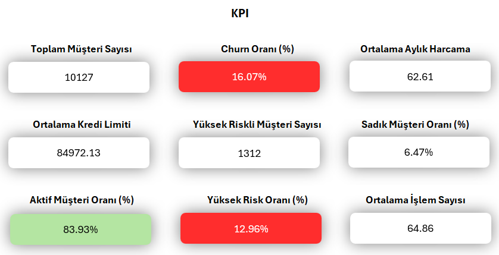
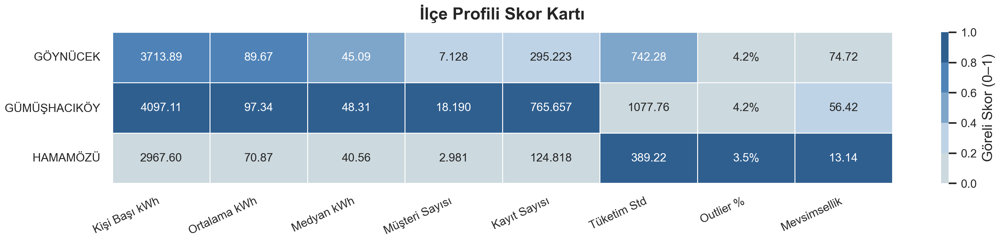
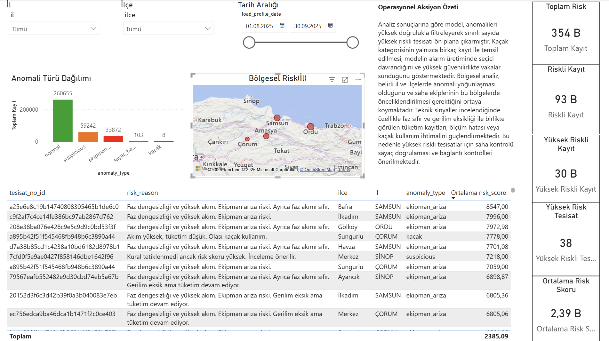

# ACV Data Analytics Case Studies Portfolio

<p align="center">

</p>

<p align="center">

</p>

<p align="center">

</p>

This repository contains three end-to-end analytics case studies developed during the **ITU&Ahmet Çalık Vakfı Advanced Data Analytics Program**.

The projects cover different stages of the data analytics workflow including:

* exploratory data analysis
* customer segmentation
* anomaly detection
* operational risk analysis
* dashboard development
* data storytelling

Technologies used across the projects include **Excel, Python, SQL, and Power BI**.

---

# Case Studies Overview

| Case Study                                | Focus Area                                          | Tools                 |
| ----------------------------------------- | --------------------------------------------------- | --------------------- |
| Credit Card Customer Analytics            | Customer segmentation and profitability analysis    | Excel, Power Query    |
| Energy Consumption & Collection Risk      | Customer segmentation and payment behavior analysis | Python                |
| Electricity Consumption Anomaly Detection | Operational anomaly detection and risk analysis     | Python, SQL, Power BI |

---

# Repository Structure

```text
acv-case-studies-portfolio
│
├── case_study_01_credit_card_customer_analytics
├── case_study_02_energy_consumption_customer_risk_analytics
└── case_study_03_electricity_consumption_anomaly_analysis
```

Each case study folder contains its own documentation, analysis notebooks, outputs, and dashboards.
