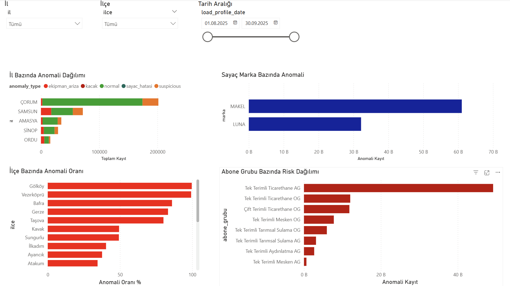
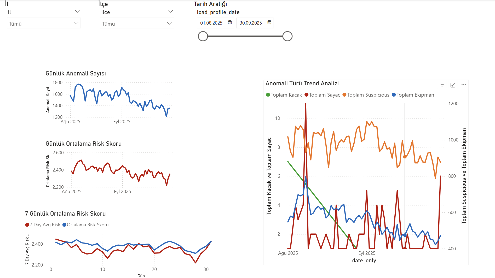
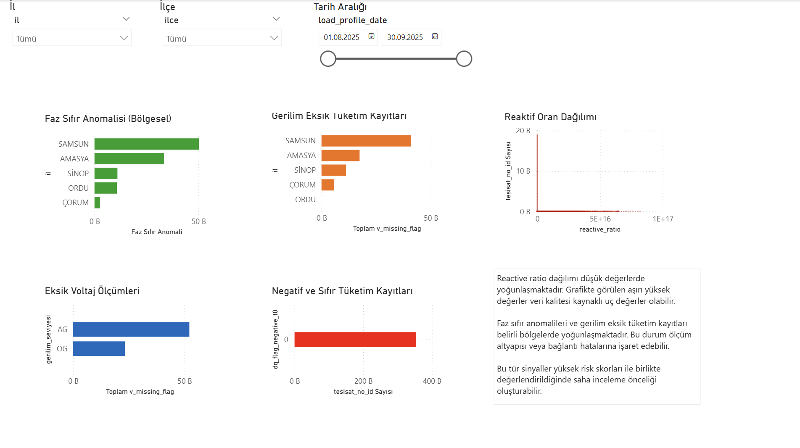
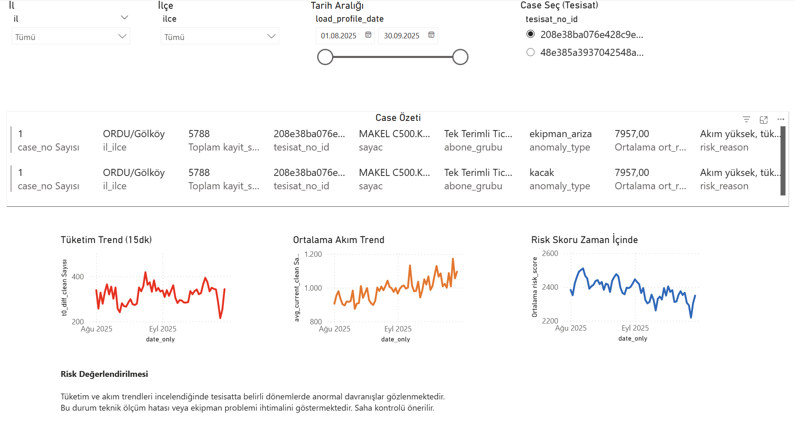
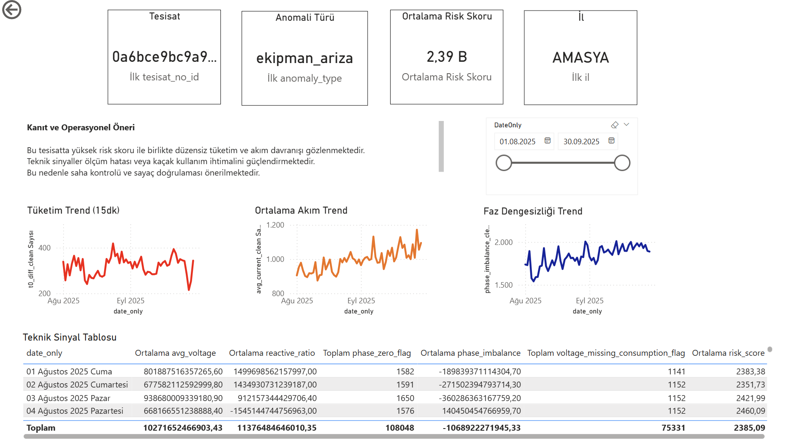

# Electricity Consumption Anomaly Detection and Operational Risk Analysis

End-to-end analytics case study analyzing electricity consumption patterns using smart meter load profile data from an electricity distribution context.

The project combines **Python-based data analysis, SQL analytical summarization, and Power BI dashboarding** to identify abnormal consumption behavior and generate operational insights for electricity distribution monitoring.

---

# Dashboard Preview

## Executive Overview

<p align="center">

</p>

This page provides a high-level operational summary of the dataset and anomaly detection results.  
Key metrics such as total analyzed records, risky records, high-risk installations, and average risk score are presented alongside anomaly type distribution and a regional risk map.

The purpose of this page is to give decision makers and operational teams a quick overview of where potential issues may exist within the electricity distribution network.

---

## Regional and Segment Analysis

<p align="center">

</p>

This page analyzes anomaly distribution across different operational dimensions including:

- province-level anomaly distribution  
- district-level anomaly rates  
- meter brand anomaly patterns  
- subscriber group risk distribution  

These insights help identify which customer segments, locations, or equipment types contribute most to operational risks.

---

## Time Trend Analysis

<p align="center">

</p>

This page focuses on the temporal evolution of anomalies and risk scores.

It includes:

- daily anomaly count trends  
- daily average risk score  
- rolling 7-day risk score averages  
- anomaly type trend comparison over time  

These visualizations help analysts detect abnormal periods, system behavior changes, or recurring operational patterns.

---

## Technical Signal Diagnostics

<p align="center">

</p>

Technical signal diagnostics focus on electrical indicators that may reveal measurement problems or infrastructure issues.

The page includes analysis of:

- phase zero anomalies  
- voltage missing while consumption continues  
- reactive energy ratio distribution  
- negative or zero consumption records  

Such patterns often indicate possible meter faults, measurement inconsistencies, or connection infrastructure problems.

---

## Case Investigation

<p align="center">

</p>

The case investigation page allows detailed inspection of selected installations.

For each installation, the dashboard displays:

- consumption trend over time  
- current behavior patterns  
- anomaly classifications  
- risk score evolution  
- operational interpretation and recommended actions  

This page supports targeted field investigation and operational decision making.

---

## Drill-Through Analysis

<p align="center">

</p>

The drill-through page enables deeper analysis of individual installations directly from anomaly records.

Users can drill into a specific installation and review:

- detailed electrical signal metrics  
- phase imbalance patterns  
- voltage and reactive behavior  
- time-based signal evolution  
- supporting technical indicators  

This functionality allows analysts to investigate anomalies at a granular level and understand the root causes behind high-risk signals.

---

# Project Objective

Electricity distribution companies monitor large volumes of smart meter data.  
However, inconsistencies between **energy consumption, current measurements, and voltage signals** may indicate operational problems.

Such anomalies may be caused by:

- electricity theft  
- meter malfunction  
- measurement infrastructure issues  
- grid or equipment failures  

The objective of this project is to identify such anomalies and highlight installations that require operational investigation.

---

# Analytical Workflow

The project follows a structured analytical pipeline.

## 1 Data Quality Assessment

Initial analysis focuses on:

- schema validation  
- duplicate detection  
- missing value analysis  
- outlier inspection  
- measurement consistency checks  

Voltage fields contain significant missing values and were handled carefully during preprocessing.

---

## 2 Feature Engineering

Several analytical features were derived to capture abnormal consumption patterns:

- avg_current  
- avg_voltage  
- phase_imbalance  
- voltage_deviation  
- reactive_ratio  
- t0_diff  
- night_ratio  
- steady_consumption_flag  
- voltage_missing_consumption_flag  

Additional time-based features include:

- date  
- hour  
- weekday  
- weekend indicator  
- time_bucket  

These variables help detect electrical and behavioral anomalies.

---

## 3 Rule-Based Anomaly Detection

The project uses an interpretable rule-based anomaly detection framework.

Example anomaly patterns include:

- high current but low consumption  
- consumption without voltage measurement  
- strong phase imbalance  
- abnormal reactive energy ratios  

Each anomaly contributes to a **risk score** used to prioritize installations for investigation.

Anomaly categories include:

- normal  
- suspicious  
- ekipman_ariza  
- sayac_hatasi  
- kacak  

---

## 4 SQL Analytical Layer

SQL queries were used to generate analytical pivot tables for reporting and dashboard inputs.

Generated summaries include:

- anomaly type distribution  
- regional anomaly counts  
- subscriber group risk analysis  
- meter brand anomaly distribution  
- daily anomaly trends  
- top risky installations  

SQL scripts are located in the `sql` directory.

---

## 5 Power BI Dashboard

A multi-page Power BI dashboard was developed to transform analytical outputs into operational insights.

Dashboard features include:

- anomaly monitoring  
- regional risk analysis  
- time trend analysis  
- technical signal diagnostics  
- installation-level investigation  

The Power BI dashboard file is available in:


powerbi/YEDAS_Anomaly_Dashboard.pbix


---

# Repository Structure

## Repository Structure

```text
ACV_cs3_electricity-consumption-anomaly-analysis
│
├── README.md
│
├── requirements.txt
├── .gitignore
│
├── docs
│  ├── data_dictionary.md
│  ├── methodology.md
│  ├── dashboard_guide.md
│  └── assumptions_limitations.md
│
├─ data/
│  ├── raw/
│  └── processed/
│
├── notebooks
│ └── ACV_EcemErdil_CS3_notebook.ipynb
│
├── sql
│ ├── pivots.sql
│ └── sql_check
│
├── outputs
│ ├── eda
│ ├── pivots
│ └── sql_pivot_check
│
├── powerbi
│ └── YEDAS_Anomaly_Dashboard.pbix
│
└── reports
  └── screenshots
      ├── 01_Executive_Overview.png
      ├── 02_Regional_Segment_Analysis.png
      ├── 03_Time_Trend_Analysis.png
      ├── 04_Technical_Signal_Diagnostics.png
      ├── 05_Case_Investigation.png
      └── 06_Drill_Through.png
```

---

# Technologies Used

Python  
Pandas  
NumPy  
Matplotlib  
Seaborn  
SQL  
SQLite  
Power BI  

---

# Installation

Install required Python libraries:

pip install -r requirements.txt

Run the analysis notebook:

notebooks/ACV_EcemErdil_CS3_notebook.ipynb


---

# Limitations

This project represents an analytical case study and has several limitations:

- anomaly detection is rule-based rather than machine-learning based  
- detected anomalies do not guarantee confirmed electricity theft  
- extreme reactive ratio values may reflect data quality issues  
- operational validation through field inspection is required  

---

# Author

Ecem Erdil  
Data Analytics Case Study
